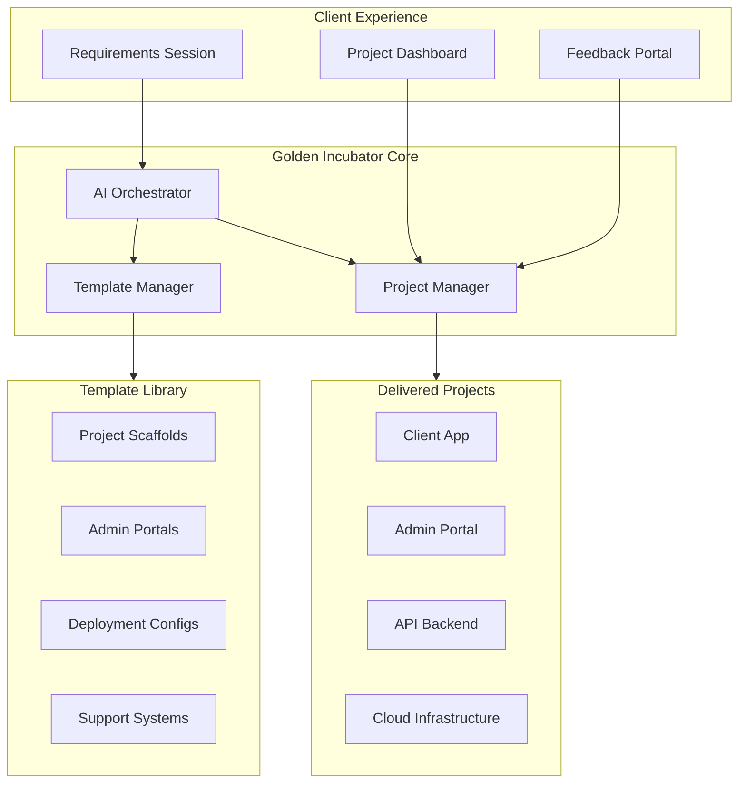
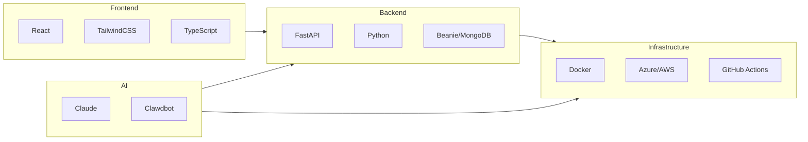
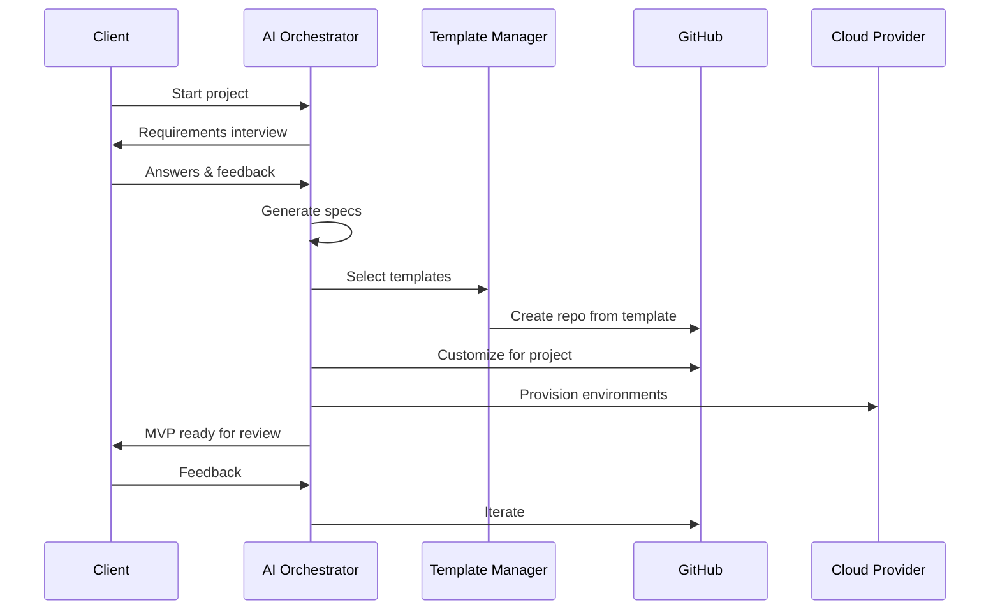

# System Architecture Overview

## The Big Picture

## Component Breakdown

### 1. Client Experience Layer
The interfaces clients interact with:
- **Requirements Session** — AI-guided requirements capture
- **Project Dashboard** — Track progress, milestones, deliverables
- **Feedback Portal** — Submit feedback, request changes

### 2. AI Orchestrator
The brain that connects everything:
- Conducts requirements interviews
- Selects appropriate templates
- Configures projects based on requirements
- Coordinates build/deploy workflows

### 3. Template Manager
Library of reusable components:
- Project scaffolding (FastAPI, React, etc.)
- Admin portal templates
- Deployment configurations
- Common patterns (auth, CRUD, etc.)

### 4. Project Manager
Tracks and delivers:
- Project state and progress
- Environment management
- Deployment orchestration
- Handoff documentation

## Technology Stack

## Data Flow

## Key Decisions

| Decision | Choice | Rationale |
|----------|--------|-----------|
| Primary Backend | FastAPI + Python | Fast to build, AI-friendly, good async |
| Database | MongoDB | Flexible schema, good for rapid iteration |
| Frontend | React + TypeScript | Industry standard, component reusability |
| Hosting | Azure or AWS | Enterprise-ready, good AI integration |
| CI/CD | GitHub Actions | Integrated with repos, easy automation |

---

*See `/decisions/` for detailed Architecture Decision Records.*
