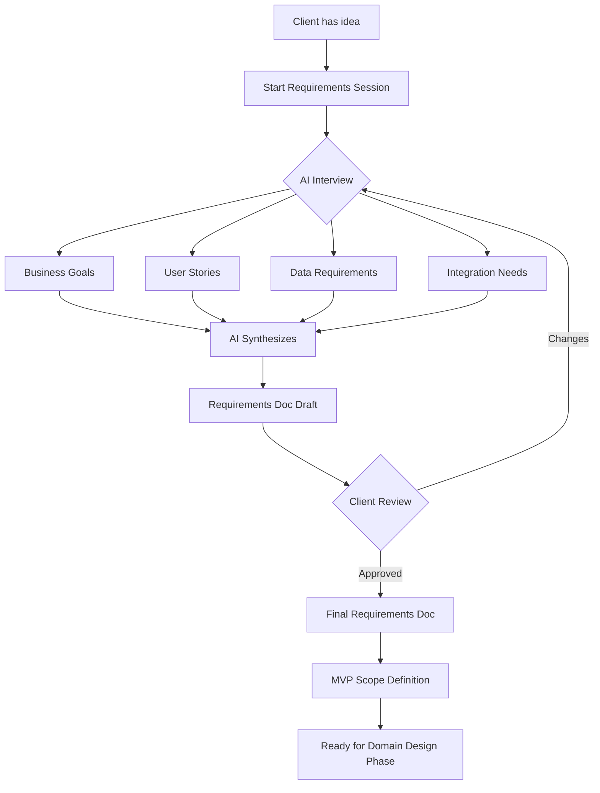

# Capability 1: Requirements Gathering

## Overview

An interactive, AI-guided process that takes a client from "I have an idea" to "Here's exactly what we're building."

## The Problem

Traditional requirements gathering is:
- Time-consuming (multiple meetings, back-and-forth)
- Often incomplete (missing edge cases, unclear scope)
- Hard to translate to technical specs
- Not reusable

## The Solution

An AI-powered conversation that:
1. Asks the right questions
2. Captures answers in structured format
3. Produces both business requirements AND technical specs
4. Includes a scoped MVP definition

## User Journey



## Outputs

### 1. Business Requirements Document
- Project overview
- Goals and success metrics
- User personas
- Core user journeys
- Out of scope items

### 2. Technical Specification
- Data model (entities and relationships)
- API endpoints needed
- Authentication requirements
- Third-party integrations
- Performance requirements

### 3. MVP Definition
- Day-1 features (absolute minimum to launch)
- Core functionality (essential for the product to be useful)

## Question Framework

The AI should cover these areas:

### Business Context
- What problem are you solving?
- Who are the users?
- What does success look like?
- Who are the competitors?

### User Experience
- Walk me through a typical user session
- What actions can users take?
- What do users see when they first arrive?
- What brings them back?

### Data & Content
- What information needs to be stored?
- Who creates/edits content?
- What needs to be searchable?
- What needs history/audit trails?

### Technical Constraints
- Any existing systems to integrate with?
- Authentication requirements?
- Mobile requirements?
- Compliance/security needs?

### Scope & Priorities
- What's the ONE thing this must do?
- What's explicitly out of scope for the MVP?
- What's the timeline?
- What's the budget range?

## Template Structure

```markdown
# Project: [Name]

## Executive Summary
[2-3 sentence overview]

## Business Goals
1. [Primary goal]
2. [Secondary goal]
3. [Tertiary goal]

## Users
### Persona 1: [Name]
- Role: 
- Goals:
- Pain points:

## User Stories
- As a [persona], I want to [action] so that [benefit]
- ...

## Data Model
[Mermaid ER diagram]

## MVP Scope
### Must Have (Launch)
-

## Out of Scope
[Captured separately — see "Out of Scope — Future Ideas" artifact]

## Technical Requirements
- Auth: [approach]
- Hosting: [approach]
- Integrations: [list]

## Open Questions
- 
```

## Implementation Notes

### For AI Agent
- Use conversational, friendly tone
- Ask one question at a time
- Summarize back what you heard
- Probe for specifics when answers are vague
- Flag potential scope creep early

### For Template
- Requirements doc should be exportable as PDF
- Should integrate with project creation (Capability 2)
- Version history for iterations

## Open Questions

- [ ] How do we handle multi-stakeholder input?
- [ ] Should there be a visual/interactive mode?
- [ ] How do we estimate effort from requirements?

---

*Status: Draft*  
*Last Updated: 2026-02-10*
