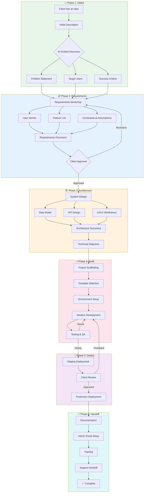

# Golden Incubator Process

The complete journey from idea to deployed software.

## Phase Summary

| Phase | Purpose | Key Outputs |
|-------|---------|-------------|
| **1. Intake** | Understand the idea | Problem statement, users, success criteria |
| **2. Requirements** | Define what to build | User stories, features, constraints |
| **3. Architecture** | Design the solution | Data model, APIs, wireframes, diagrams |
| **4. Build** | Construct the software | Working application with tests |
| **5. Deploy** | Ship to production | Live application |
| **6. Handoff** | Transfer ownership | Docs, training, support setup |

## Current Focus

We're building out **Phase 1 & 2** first — the AI-guided intake and requirements process. This is where Golden Incubator provides the most immediate value: turning a rough idea into a clear, buildable specification.
